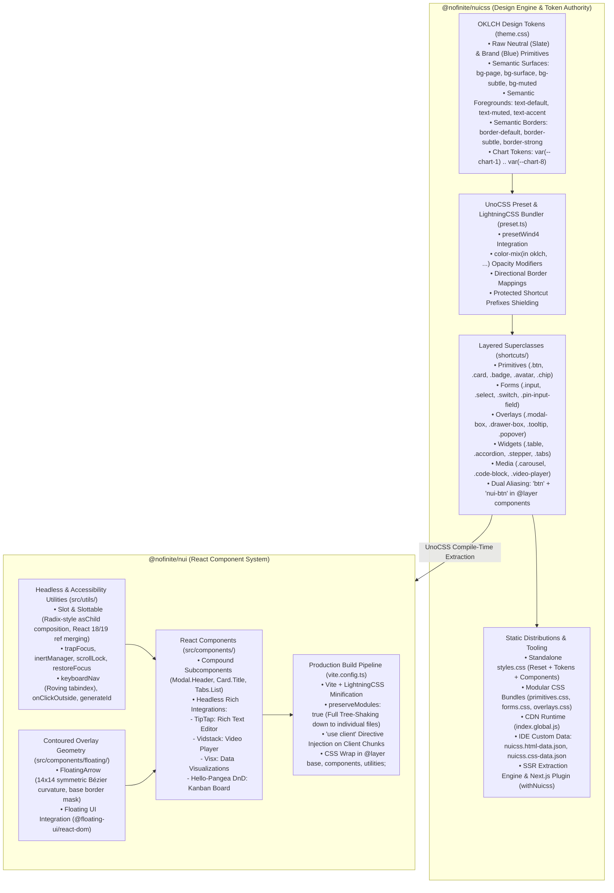

# Nofinite Stack Architecture & Engineering Standards

## `@nofinite/nuicss` and `@nofinite/nui`

This document serves as the authoritative, deep-dive architectural specification, design system contract, and engineering guide for the **Stack** monorepo, covering:

1. **`@nofinite/nuicss`**: The token-first, semantic design engine, UnoCSS preset, and CSS architecture.
2. **`@nofinite/nui`**: The production-grade, headless-augmented React component library.

All contributing engineers and AI agents must strictly uphold the architectural invariants, engineering patterns, and verification standards documented here.

---

## 1. System Topology & Dual-Layer Architecture

The Stack monorepo operates on a clean separation of concerns: styling primitives and design tokens are completely decoupled from UI runtime logic.



---

## 2. Deep Dive: `@nofinite/nuicss`

`@nofinite/nuicss` is the sole source of truth for all visual presentation across the ecosystem. It replaces traditional atomic CSS utility chaos with a structured, three-tier token hierarchy and semantic superclasses.

### 2.1. The Three-Tier OKLCH Token Hierarchy

Tokens are defined in [`src/styles/theme.css`](file:///d:/stack/packages/nuicss/src/styles/theme.css) using progressive enhancement: standard hex fallbacks paired with high-gamut `oklch()` values:

```css
/* Tier 1: Raw Primitives (Never used directly in component markup) */
--slate-50: #f8fafc;
--slate-50: oklch(0.984 0.006 247.858);
--brand-500: #3b82f6;
--brand-500: oklch(0.623 0.214 259.815);

/* Tier 2: Brand & Semantic System Tokens */
--brand-primary: var(--brand-600);
--color-primary: var(--brand-primary);
--color-danger: var(--red-600);
--color-success: var(--green-600);
--color-warning: var(--amber-500);

/* Tier 3: Contextual Surface, Foreground & Border Tokens */
--bg-page: var(--slate-50);
--bg-surface: #ffffff;
--bg-subtle: var(--slate-100);
--fg-default: var(--slate-900);
--fg-muted: var(--slate-500);
--border-default: var(--slate-200);
--border-strong: var(--slate-300);

/* Chart Tokens (Strict 8-Color Palette) */
--chart-1: oklch(0.623 0.214 259.815);
--chart-2: oklch(0.685 0.169 237.323);
/* ... through --chart-8 */
```

### 2.2. UnoCSS Preset & LightningCSS Integration (`src/plugin/preset.ts`)

`nuicssPreset()` configures UnoCSS with unique architectural capabilities:

1. **Native Opacity Modifiers via `color-mix`:**
   Instead of fragile hex alpha hacks or opacity classes that affect child text, NUICSS generates pure OKLCH color mixes:
   ```ts
   // Example rule from preset.ts:
   // matches bg-surface/80, bg-primary/20, text-muted/60
   const val = opacity
     ? `color-mix(in oklch, var(${varName}) ${opacity}%, transparent)`
     : `var(${varName})`;
   ```
2. **Directional Border Rules:**
   Supports `border-t-subtle`, `border-b-strong`, `border-x-default/50` mapping accurately to directional CSS properties (`border-top-color`, etc.).
3. **Protected Shortcut Prefixes Shielding:**
   Prevents `@unocss/preset-wind4` pseudo-variants from incorrectly intercepting compound class names such as `empty-state`, `link-muted`, `hover-card`, and `link-preview`.

### 2.3. Layered Shortcuts & Dual Namespace Aliasing (`src/shortcuts/index.ts`)

Every component superclass is processed through `createLayeredShortcuts()`:

1. Assigned strictly to the W3C `@layer components` stylesheet layer.
2. Automatically generates dual aliases: concise names (e.g. `btn`, `card`, `modal-box`) alongside namespace-safe names (`nui-btn`, `nui-card`, `nui-modal-box`).
   This allows developers in collision-prone environments to use prefixed classes without separate builds.

### 2.4. Build Pipelines & Tooling Outputs (`build-cdn.js`)

Running the NUICSS build generates:

- **`dist/styles.css`:** Complete standalone stylesheet wrapping `@layer base, components, utilities;` with design tokens, reset, and all superclasses minified via LightningCSS.
- **`dist/components.css` / `dist/{primitives,forms,overlays,widgets,media}.css`:** Granular modular stylesheets for targeted inclusion.
- **`dist/index.global.js`:** Single-script CDN browser runtime that compiles UnoCSS on the fly for rapid prototyping.
- **`dist/nuicss.html-data.json` & `dist/nuicss.css-data.json`:** Official VS Code and Cursor Custom Data manifests providing rich HTML/CSS IntelliSense autocomplete for all 819+ classes and 246+ tokens.

### 2.5. Framework Adapters: Next.js, Turbopack, and SSR

- **`withNuicss` ([`src/plugin/next.ts`](file:///d:/stack/packages/nuicss/src/plugin/next.ts)):** Wraps Next.js configurations. Configures `transpilePackages: ['@nofinite/nuicss']`, injects PostCSS plugins, and maps Turbopack `resolveAlias` for `@nofinite/nuicss/virtual.css` across both Next.js 14 and Next.js 15.
- **Critical CSS SSR Extractor ([`src/helpers/ssr.ts`](file:///d:/stack/packages/nuicss/src/helpers/ssr.ts)):** Extracts critical CSS from HTML strings during SSR with zero-FOUC output and an in-memory generator cache.
- **Anti-FOUC Script ([`src/helpers/fouc.ts`](file:///d:/stack/packages/nuicss/src/helpers/fouc.ts)):** Inlines an ultra-lightweight inline `<script>` into document `<head>` to synchronize dark mode (`class="dark"` and `data-theme="dark"`) prior to first paint.

---

## 3. Deep Dive: `@nofinite/nui`

`@nofinite/nui` is a modern React component library designed for tree-shaking, strict accessibility, and seamless integration with `@nofinite/nuicss`.

### 3.1. Build System & Module Architecture ([`vite.config.ts`](file:///d:/stack/packages/nui/vite.config.ts))

The NUI build pipeline is engineered with three essential Rollup/Vite features:

1. **`preserveModules: true` & `preserveModulesRoot: 'src'`:**
   Instead of bundling everything into monolithic chunks, Vite emits a 1:1 file mirror in `dist/`. Consumers can import `@nofinite/nui/components/button` and bundle only 1.5 kB of code with zero dead-code leakage.
2. **`add-use-client` Rollup Plugin:**
   Scans every emitted chunk in `dist/components/` and `index.js/cjs`. Injects `"use client";` banners at the very top of each client chunk, ensuring flawless compatibility with the Next.js App Router and React Server Components (RSC).
3. **`wrap-styles-in-layer` Plugin:**
   Post-processes `dist/styles.css`. Enforces the standard preamble:
   ```css
   @layer base, components, utilities;
   ```
   Injects base tokens and wraps extracted classes into `@layer components`. This guarantees that user utilities can always override component styles without resorting to `!important`.

### 3.2. Polymorphism & Composition: Radix-Grade `Slot` ([`src/utils/slot/slot.tsx`](file:///d:/stack/packages/nui/src/utils/slot/slot.tsx))

NUI components support `asChild` composition via an internal `Slot` primitive:

- **Ref Composition (`composeRefs`):** Safely merges forwarded refs and child element refs without memory leaks.
- **Cross-Version React Support (`getElementRef`):** Extracts refs accurately across both React 18 (`element.ref`) and React 19 (`element.props.ref`) without TypeScript `any` escapes.
- **Prop Merging (`mergeProps`):** Chains event handlers so that both the parent slot handler and the child handler fire sequentially; combines style objects; and merges class names through `cn()`.

### 3.3. Headless Accessibility Primitives (`src/utils/`)

NUI components do not rely on bulky external runtime accessibility libraries. They utilize focused, lightweight internal primitives:

- **`trapFocus` (`src/utils/trapfocus/`):** Listens to Tab and Shift+Tab to trap keyboard focus within active dialogs and modals.
- **`inertManager` (`src/utils/inertmanager/`):** Manages the HTML `inert` attribute on outside DOM trees while overlays are active.
- **`scrollLock` (`src/utils/scrolllock/`):** Safely locks body scroll without page jumping by accounting for scrollbar width.
- **`restoreFocus` (`src/utils/restorefocus/`):** Automatically returns focus to the trigger element upon overlay dismissal.
- **`keyboardNav` (`src/utils/keyboardnav/`):** Implements roving tabindex for dropdowns, listboxes, menus, and tabs.

### 3.4. High-Precision Overlay Architecture: `FloatingArrow` ([`src/components/floating/`](file:///d:/stack/packages/nui/src/components/floating/FloatingArrow.tsx))

Floating overlays (`Tooltip`, `HoverCard`, `Popover`) strictly forbid crude 45°-rotated square `div`s. Rotated boxes produce harsh 90° right isosceles triangles with visible internal border artifacts and clipped shadows.

NUI implements a contoured, mathematical SVG primitive:

- **Symmetric ViewBox (`0 0 14 14`):** Arrow vertex coordinates curve gently via quadratic Bézier paths (`Q 7 14 8.5 12.5`).
- **Midpoint Rotation:** Centering the geometry at `(7, 7)` allows pure CSS rotation (`0deg`, `90deg`, `180deg`, `270deg`) across all 4 axes (`top`, `bottom`, `left`, `right`) with exact geometric alignment and zero asymmetric offset calculation.
- **Open-Base Masking:** The SVG base is open (`M 0 7 L 5.5 12.5 ... L 14 7 Z`), ensuring the arrow seamlessly merges into the card border without cutting across the card background.

### 3.5. Compound Component Architecture

Complex UI elements (`Modal`, `Card`, `Drawer`, `Tabs`) offer dual ergonomics:

1. **Declarative Flat Props:** `<Modal title="Settings" footer={<Button>Save</Button>}>...</Modal>` for rapid implementation.
2. **Compound Subcomponents:** `<Modal.Header>`, `<Modal.Title>`, `<Modal.Description>`, `<Modal.Body>`, `<Modal.Footer>` for fine-grained structural control.

---

## 4. Core Design System Invariants

1. **Single Source of Truth Rule:**
   - **Zero Hardcoded Colors:** Never write `#ffffff`, `#3b82f6`, `rgb(...)`, or raw Tailwind palette clusters (`bg-blue-600 dark:bg-blue-500`, `text-slate-900`).
   - **Always Use Semantic Tokens:** Use `var(--color-primary)`, `var(--bg-surface)`, `var(--fg-default)`, `var(--border-default)`.
   - **Charts:** Exclusively use `var(--chart-1)` through `var(--chart-8)`.
2. **Superclass Enforcement:**
   - Standard UI components must declare official NUICSS superclasses (`btn`, `card`, `modal-box`, `input`, `badge`, `table-container`, `tooltip`) rather than stacking 10–15 atomic Tailwind utilities.
3. **Automatic ARIA State Driven Styling:**
   - State styling belongs in native WAI-ARIA attributes:
     - `aria-invalid="true"`: Danger border and focus ring.
     - `aria-selected="true"`: Active tab indicator.
     - `aria-expanded="true"`: Accordion chevron rotation and popover visibility.
     - `aria-checked="true"`: Switch toggle activation.
4. **CSS Cascade Safety & Container Hierarchies:**
   - Never combine conflicting utility classes (e.g. combining `py-0` with `pb-5` wipes out bottom padding).
   - Maintain structural separation with dedicated containers (`.modal-box`, `.modal-body`, `.modal-footer`).
   - Dedicated footers must provide explicit top dividers (`border-t border-default`), subtle background tints (`bg-subtle/20`), and generous padding (`px-6 py-4`). Action buttons must never sit against outer container edges.

---

## 5. Agent & Developer Engineering Standards

All engineers and AI agents working in this repository must strictly adhere to this 6-pillar operational standard:

### Pillar 1: Implementation Plans (`implementation_plan.md`)

- Mandatory for any architectural changes, major bug fixes, or modifications spanning multiple components or files.
- Document user review requirements, proposed file changes (`[NEW]`, `[MODIFY]`, `[DELETE]`), and verification steps.
- Obtain user approval before writing production code.

### Pillar 2: Industry Standards & Tool Evaluation

- Never introduce dependencies on whim.
- Evaluate performance, bundle size, license, and architectural compatibility. Document the justification.

### Pillar 3: Scratch File Quarantine (`/temp/`)

- ALL temporary scripts, debug files, Playwright scripts, and screenshots MUST be stored in `/temp/`.
- The `/temp/` directory is gitignored to ensure zero garbage is committed to the repository root.

### Pillar 4: Multi-Tier Verification

- **Automated Unit Tests:** Execute Vitest test suites (`pnpm nx test nui -- --testFile=...`).
- **Visual Playwright Verification:** Run headless Playwright scripts in `/temp/` to generate visual snapshots, and inspect rendered artifacts using `view_file` to verify spacing and layout.
- **Production Builds:** Verify that `pnpm nx build nui` succeeds with zero errors.

### Pillar 5: NPM Package Verification (`npm pack`)

- Before finalizing any release or build pipeline change, run `npm pack --dry-run` in `packages/nui` and `packages/nuicss`.
- Verify the tarball manifest: confirm `dist/`, TypeScript definitions (`dist/types/`), and stylesheets are present.
- Never publish empty or null directories.

### Pillar 6: Compulsory Local Git Commits

- Immediately commit changes locally using Git after completing every phase or fix.
- Local commits serve as immutable save points for rollback and auditability.
- Follow Conventional Commits format (`refactor(nui): ...`, `feat(nuicss): ...`, `fix(nui): ...`).
