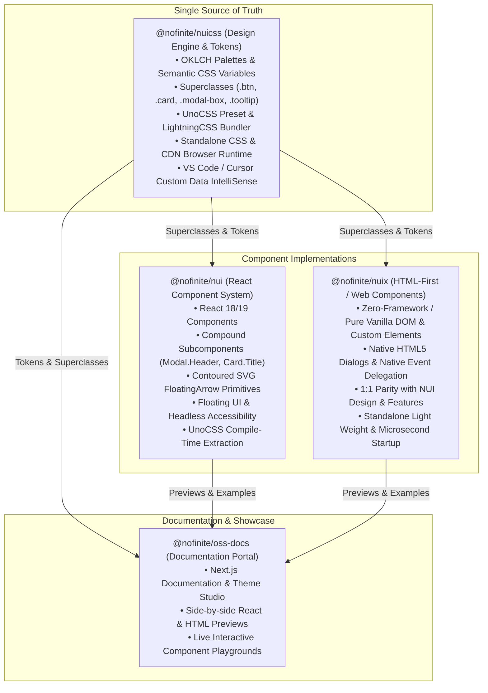

# Ecosystem Architecture & Agent Engineering Standards

This document establishes the official architectural foundations, design system contracts, component paradigms, and engineering standards across the Nofinite ecosystem: **`@nofinite/nuicss`**, **`@nofinite/nui`**, **`@nofinite/nuix`**, and **`@nofinite/oss-docs`**.

All AI agents and contributing engineers MUST strictly adhere to the principles and patterns detailed here.

---

## 1. High-Level Ecosystem Topology

The ecosystem is built around a single, unified styling and token foundation that powers both React and zero-framework HTML/Web Components:



---

## 2. The Three Architectural Pillars

### 2.1. `@nofinite/nuicss` — The Styling Single Source of Truth

- **Role:** The foundational design engine for the entire ecosystem.
- **Tokens:** OKLCH-based color system adapting to Light, Dark, and High-Contrast modes.
  - Backgrounds: `bg-page`, `bg-canvas`, `bg-surface`, `bg-subtle`, `bg-muted`
  - Foregrounds: `text-default`, `text-subtle`, `text-muted`, `text-accent`, `text-inverse`
  - Borders: `border-default`, `border-subtle`, `border-strong`, `border-focus`
  - Accents: `primary`, `secondary`, `danger`, `success`, `warning`, `info`
  - Charts: `var(--chart-1)` through `var(--chart-8)`
- **Superclasses:** High-level component classes (e.g. `.btn`, `.btn-primary`, `.card`, `.card-body`, `.modal-box`, `.modal-footer`, `.tooltip`, `.popover-content`, `.pin-input-field`).
- **Zero Raw Tailwind Clusters:** Components never declare 10–15 atomic classes for standard UI primitives.
- **IntelliSense Custom Data:** Automatically generates `nuicss.html-data.json` and `nuicss.css-data.json` for IDE autocomplete.

### 2.2. `@nofinite/nui` — The React Component System

- **Role:** Modern, tree-shakable React component library.
- **Style Consumption:** Strictly consumes `@nofinite/nuicss` tokens and superclasses via UnoCSS compile-time shortcuts.
- **Compound Component Ergonomics:** Supports both flat props (e.g. `<Modal footer={...}>`) and compound subcomponents (`<Modal.Header>`, `<Modal.Title>`, `<Modal.Body>`, `<Modal.Footer>`).
- **Overlay Engineering:** Integrates Floating UI with high-precision SVG primitives (such as `FloatingArrow`) rather than crude CSS box rotations.
- **Distribution:** Dual ESM/CJS outputs with automatic `"use client"` chunk headers and bundled type definitions.

### 2.3. `@nofinite/nuix` — Zero-Framework / HTML-First Engine

- **Role:** Framework-agnostic, lightweight HTML/Custom Elements library.
- **Design Parity:** Identical visual styling and feature set to `@nofinite/nui` without React dependencies.
- **DOM Primitives:** Utilizes native `<dialog>`, `data-*` attributes (`data-toggle="modal"`, `data-tooltip="..."`), and delegated global event listeners.
- **Style Consumption:** Adheres to the exact same `@nofinite/nuicss` stylesheet classes as NUI.

---

## 3. Core Architectural Invariants (The Non-Negotiables)

1. **Single Source of Truth Rule:**

   - **Never** introduce hardcoded hex/sRGB color literals (`#3b82f6`, `rgb(...)`) or raw Tailwind color palettes (`bg-blue-600`, `text-slate-900`) when a NUICSS token (`var(--color-primary)`, `var(--bg-surface)`) or superclass exists.
   - All chart colors must use `var(--chart-1)` through `var(--chart-8)`.

2. **Automatic WAI-ARIA Driven State Styling:**

   - Interactive states are declared using native ARIA attributes:
     - `aria-invalid="true"`: Automatically renders danger borders and focus rings.
     - `aria-selected="true"`: Automatically renders active tab indicators.
     - `aria-expanded="true"`: Automatically handles accordion icon rotation and dropdown visibility.
     - `aria-checked="true"`: Automatically activates switches and checkboxes.
   - Avoid manual JS toggle classes (e.g., `is-active`, `is-invalid`) when standard ARIA attributes exist.

3. **1:1 Component Parity:**
   - Any design improvement, token adjustment, or bug fix applied to a component in `@nofinite/nui` must be evaluated and mirrored in `@nofinite/nuix` (and vice-versa).

---

## 4. Engineering & Micro-Design Patterns Observed

### 4.1. Contoured Floating Arrows (`FloatingArrow`)

- **Anti-Pattern:** Rotating a square `div` 45° (`w-3 h-3 rotate-45 border border-default`). This produces a harsh 90° right isosceles triangle with visible internal borders and misaligned offsets.
- **Standard:** Use a dedicated 14x14 symmetric SVG arrow with quadratic Bézier tip curvature:
  ```svg
  <svg width="14" height="14" viewBox="0 0 14 14">
    <path d="M 0 7 L 5.5 12.5 Q 7 14 8.5 12.5 L 14 7 Z" />
  </svg>
  ```
  - Centered rotation around `(7, 7)` guarantees exact geometric symmetry across `top`, `bottom`, `left`, and `right` placements.
  - Open base seamlessly masks against the container border with zero internal line artifacts.

### 4.2. Spacing, Cascade Safety, and Container Hierarchies

- **Anti-Pattern (Cascade Trap):** Writing `className="modal-body px-5 pb-5 overflow-y-auto py-0"`. The `py-0` utility wipes out `pb-5`, leaving zero bottom padding and causing action buttons to collide with the edge of the container.
- **Standard:**
  - Separate content and actions into dedicated sub-containers:
    - `.modal-box` -> `.modal-header` -> `.modal-body` -> `.modal-footer`
  - `.modal-footer`: Explicit top border (`border-t border-default`), subtle tinted background (`bg-subtle/20`), and generous padding (`px-6 py-4`).
  - Action buttons must sit comfortably inside the footer with ample breathing room.
  - Close buttons (`.modal-close`, `.popover-close`) must have comfortable clearance (`top-4 right-4`).

### 4.3. Compound Component Architecture

- When building complex components (`Modal`, `Card`, `Drawer`, `Popover`):
  1. Export compound child components (`Component.Header`, `Component.Body`, `Component.Footer`, `Component.Title`, `Component.Description`).
  2. Support standard convenience props (`title`, `description`, `footer`) for straightforward declarative usage while seamlessly allowing subcomponent composition for advanced layouts.

---

## 5. Agent Standards & Operating Protocols

All autonomous and semi-autonomous AI agents working within this repository must adhere to the following 6-step operational protocol:

### Step 1: Implementation Plans

- For major architectural changes, complex bug fixes, or refactors spanning multiple files, write an `implementation_plan.md` artifact detailing user review requirements, proposed changes, and verification plans.
- Wait for explicit user confirmation before modifying production code.

### Step 2: Tool & Alternative Comparison

- When introducing a new dependency or utility, evaluate alternatives, document why the chosen solution is the most performant and minimal, and confirm alignment with existing architecture.

### Step 3: Temporary Scratch File Quarantine (`/temp/`)

- ALL AI-generated scratch scripts, test scripts, diagnostic tools, Playwright runners, and debug screenshots MUST be placed in the `/temp/` directory.
- Never write scratch files or temporary garbage into project root directories or package sources. `/temp/` is gitignored.

### Step 4: Multi-Tier Verification

Before declaring any task complete:

1. **Unit & Integration Tests:** Run Vitest/Jest test suites (`pnpm nx test nui -- --testFile=...`).
2. **Visual Verification:** Run Playwright capture scripts in `/temp/` to generate visual snapshots, and inspect them using the `view_file` tool to confirm layout, spacing, and rendering quality.
3. **Production Builds:** Execute package builds (`pnpm nx build nui`, `npm run build`).

### Step 5: NPM Package Verification (`npm pack`)

- Before finalizing build pipeline changes or package updates, run `npm pack --dry-run` in the package directory.
- Verify tarball entries to ensure all compiled files (`dist/`), type declarations (`dist/types/`), and stylesheets are present.
- Confirm zero empty or null folders are packaged.

### Step 6: Compulsory Local Git Commits

- Immediately after making changes and verifying them, execute a local git commit.
- Never leave working directories dirty between user tasks.
- Commit messages must follow Conventional Commits format (e.g. `refactor(nui): ...`, `fix(nuix): ...`, `feat(nuicss): ...`).
