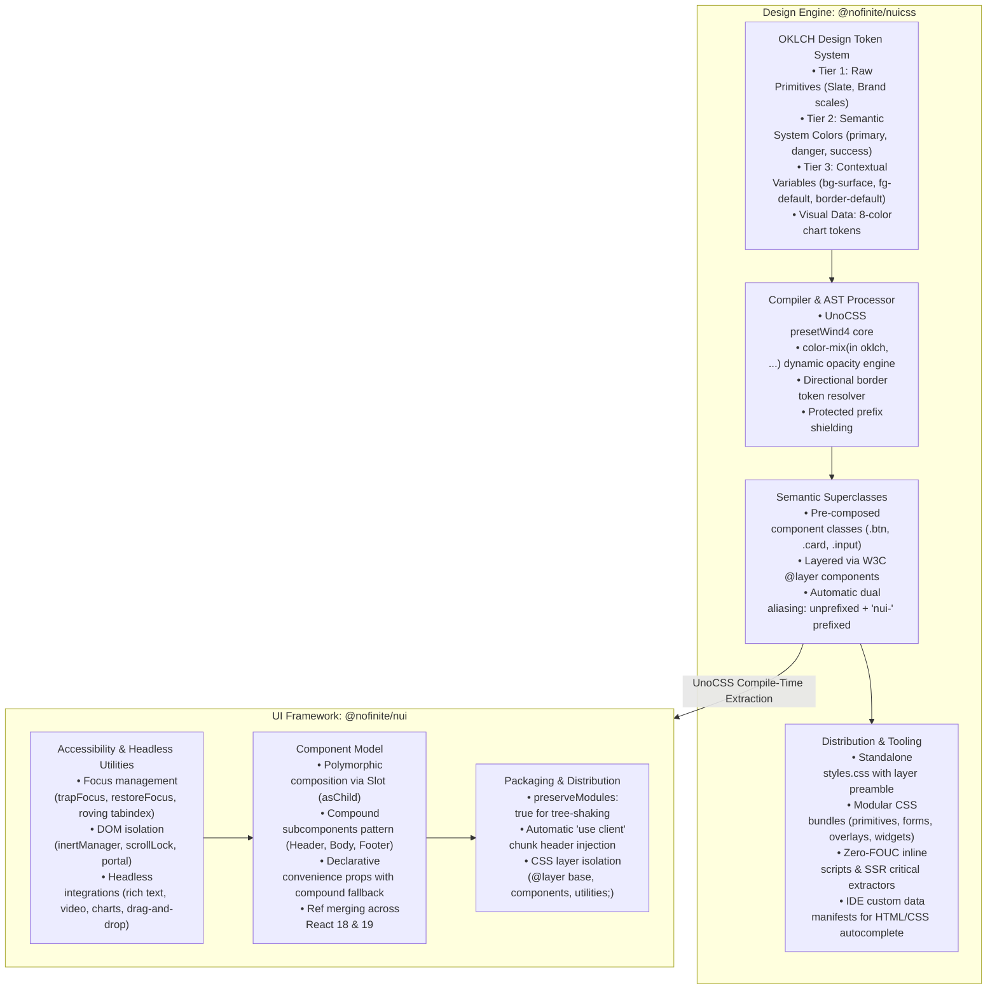

# Stack Architecture & Engineering Standards

## `@nofinite/nuicss` and `@nofinite/nui`

This document defines the systemic architectural foundations, design system contracts, component paradigms, and engineering standards for the **Stack** monorepo (`@nofinite/nuicss` and `@nofinite/nui`).

---

## 1. System Topology & Dual-Layer Architecture

The Stack architecture strictly decouples design tokens and visual style generation from UI component logic:

---

## 2. Design System Architecture: `@nofinite/nuicss`

`@nofinite/nuicss` is the sole source of truth for all visual presentation across the ecosystem. It replaces ad-hoc atomic utility styling with a structured token hierarchy and semantic superclasses.

### 2.1. The Three-Tier OKLCH Token Model

1. **Tier 1 — Raw Primitives:** High-gamut OKLCH values paired with sRGB hex fallbacks. Primitives are never used directly in component templates.
2. **Tier 2 — System Semantics:** Functional variables representing intent (`--color-primary`, `--color-danger`, `--color-success`, `--color-warning`).
3. **Tier 3 — Contextual Surfaces, Foregrounds & Borders:** Theme-reactive variables (`--bg-page`, `--bg-surface`, `--bg-subtle`, `--fg-default`, `--fg-muted`, `--border-default`, `--border-strong`).
4. **Data Visualization Tokens:** Strict 8-color chart tokens (`--chart-1` through `--chart-8`).

### 2.2. CSS Engine & AST Processing

- **Dynamic Opacity Generator:** Uses CSS `color-mix(in oklch, var(...) ${opacity}%, transparent)` instead of fragile alpha hexes or opacity classes that degrade text rendering.
- **Directional Property Mapping:** Resolves directional modifiers (`border-t-subtle`, `border-x-strong`) directly to discrete CSS properties without utility bloat.
- **Protected Prefix Shielding:** Prevents pseudo-variant processors from corrupting compound class names.

### 2.3. Layered Superclasses & Dual Aliasing

- **Layer Encapsulation:** Every shortcut is injected into the W3C `@layer components` cascade.
- **Dual-Namespace Aliasing:** Automatically generates concise (`.btn`, `.card`) and namespace-safe (`.nui-btn`, `.nui-card`) selectors, preventing collisions in mixed-library environments.

### 2.4. Tooling & Platform Integrations

- **Layer Preamble:** Standalone stylesheets enforce `@layer base, components, utilities;`, guaranteeing that user styles override components without `!important`.
- **SSR & Anti-FOUC Engine:** Critical CSS extraction during SSR and inline dark-mode synchronization scripts to ensure zero flash of unstyled content.
- **IDE IntelliSense Custom Data:** Automated generation of `nuicss.html-data.json` and `nuicss.css-data.json` for IDE autocomplete across HTML and CSS.

---

## 3. Component Architecture: `@nofinite/nui`

`@nofinite/nui` implements accessible, tree-shakable React components that strictly consume `@nofinite/nuicss` tokens and superclasses.

### 3.1. Component Model & Composition

- **Polymorphism via `Slot` (`asChild`):** Enables swapping the underlying HTML element while merging props, styles, class names, and forwarded refs across React 18 and React 19.
- **Compound Component Ergonomics:** Complex components provide compound subcomponents (`.Header`, `.Body`, `.Footer`, `.Title`, `.Description`) while maintaining backwards-compatible declarative convenience props.
- **Ref Composition:** Safely chains forwarded refs and child refs without memory leaks or unnecessary re-renders.

### 3.2. Headless Accessibility Architecture

- Components avoid heavy external UI runtime dependencies. Instead, they consume modular, focused internal utilities:
  - **Focus Management:** Focus trapping inside active overlays, automatic return-of-focus upon dismissal, and roving `tabindex` for lists and menus.
  - **DOM State Isolation:** Body scroll locking without layout shift, `inert` attribute management on inactive background trees, and portal rendering.

### 3.3. Build, Packaging & Module Tree-Shaking

- **Preserved Modules:** The build pipeline maintains the source directory structure (`preserveModules: true`), enabling direct single-component imports with zero unused bundle weight.
- **React Server Components (RSC) Readiness:** A Rollup post-processor scans component chunks and injects `"use client";` headers at the top of client boundary modules.

---

## 4. Architectural Invariants (Non-Negotiables)

1. **Single Source of Truth Rule:**
   - **Zero Raw Color Literals:** Never write hardcoded hex/sRGB color literals (`#3b82f6`, `rgb(...)`) or raw Tailwind color palettes (`bg-blue-600`, `text-slate-900`) in component code.
   - **Semantic Variables Only:** Always use semantic tokens (`var(--color-primary)`, `var(--bg-surface)`, `var(--fg-default)`).
   - **Charts:** Exclusively consume `var(--chart-1)` through `var(--chart-8)`.
2. **Superclass Enforcement:**
   - UI components must declare official NUICSS superclasses (`btn`, `card`, `input`, `badge`, `table-container`) rather than assembling verbose clusters of 10–15 atomic classes.
3. **Automatic ARIA-Driven State Styling:**
   - Visual states bind directly to native WAI-ARIA attributes (`aria-invalid`, `aria-selected`, `aria-expanded`, `aria-checked`). Avoid custom JS toggle classes.
4. **CSS Cascade Safety & Container Hierarchies:**
   - Avoid utility collision traps (such as overlapping padding/margin resets).
   - Maintain structural separation between header, content, and action containers.

---

## 5. Developer & Agent Operating Protocol

All engineers and AI agents working in this repository must strictly adhere to this 6-pillar operational protocol:

### Pillar 1: Implementation Plans (`implementation_plan.md`)

- Mandatory for any architectural changes, major refactors, or modifications spanning multiple files.
- Document user review requirements, proposed changes, and verification steps; obtain approval before modifying code.

### Pillar 2: Industry Standards & Dependency Evaluation

- Never introduce dependencies on whim.
- Evaluate performance, bundle footprint, license, and architectural fit; explicitly document rationale.

### Pillar 3: Scratch File Quarantine (`/temp/`)

- ALL temporary scripts, test runners, diagnostic tools, and screenshots MUST reside in `/temp/`.
- The `/temp/` directory is gitignored to ensure zero clutter in repository roots.

### Pillar 4: Multi-Tier Verification

- **Automated Unit Tests:** Execute Vitest test suites (`pnpm nx test nui`).
- **Visual Verification:** Run headless Playwright scripts in `/temp/` and inspect screenshots using `view_file`.
- **Production Builds:** Verify package builds succeed with zero errors (`pnpm nx build nui`).

### Pillar 5: NPM Package Verification (`npm pack`)

- Always execute `npm pack --dry-run` before finalizing releases.
- Verify tarball manifests: confirm `dist/`, TypeScript declarations (`dist/types/`), and stylesheets are physically present.
- Never publish empty or null directories.

### Pillar 6: Compulsory Local Git Commits

- Immediately commit changes locally after completing and verifying each phase or fix.
- Local commits serve as immutable checkpoints for auditability and rollback.
- Follow Conventional Commits format (`refactor(nui): ...`, `feat(nuicss): ...`, `fix(nui): ...`).
